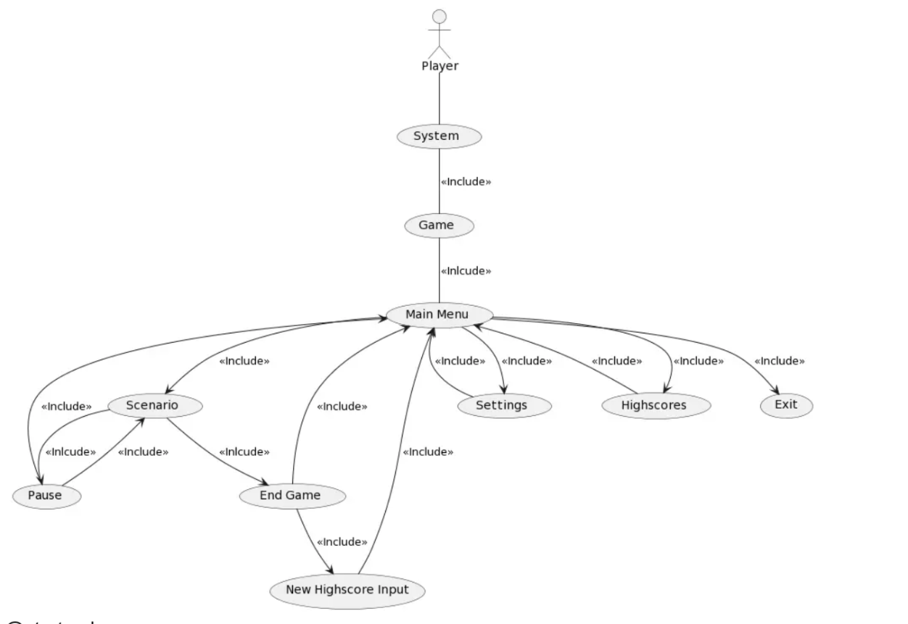
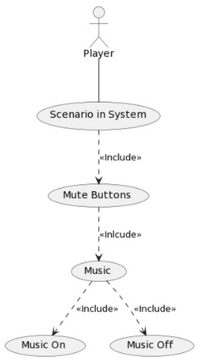

<h1>Use Case Diagrams </h1>
Right-click images and open in new tab to zoom in

<h2>Use Case: Play Game</h2>

- Primary Actor: User/Player
- Supporting Actors: N/A
- Precondition: Player is ready to play the game and has ran it on the specified system; the system is displaying the main menu
- Trigger: The player presses the start button which triggers the scenario to run and the game to play out
- Main Success Scenario: 
	1. Player begins the game and is presented with the game’s instructions
	2. Player plays the game and is displayed with a end screen that presents them with their score and asks whether they want their score to be saved on the leaderboard
	3. If the player decides to save their score in the leaderboard, the leaderboard will be updated and displayed to the user; otherwise, the player will be displayed the leaderboard compared to their score
	4. Player is redirected to the main menu of the game
- Secondary Scenarios:
	- N/A: Even if the player performs badly/cannot finish the game, they will still be directed through this process; their reputation score will simply be lower, relating to a lower score
- The game/system must also be able to run the scenario with no implications/problems. Therefore, there should be no issue in completing the scenario
- Success Postcondition:
	- The player has completed the scenario and receives a score that qualifies for the leaderboard
		- They either decide to integrate their score into the leaderboard, at which point the leaderboard is updated and displayed to the user;
		- Or, the user decides not to integrate their score into the leaderboard and their score is displayed alongside the leaderboard
	- The player is redirected to the main menu
- Minimal Postcondition:
	- The player has completed the scenario poorly/averagely and receives a score
		- They either decide to integrate their score into the leaderboard, at which point the leaderboard is updated and displayed to the user;
		- Or, the user decides not to integrate their score into the leaderboard and their score is displayed alongside the leaderboard
	- The player is redirected to the main menu

<figure markdown>
  
  <figcaption>Use case diagram for playing the game (version 1)</figcaption>
</figure>

During development, we decided, we decided that highscores would be easier to display from the menu. The diagram below shows this change. 
Through further evaluation, we decided to display the whole transition diagram in the use case to make development easier later.
<figure markdown>
  
  <figcaption>Use case for playing the game (updated version)</figcaption>
</figure>

<h2>Use Case: Mute Sound and Music</h2>
- Primary Actor: User/Player
- Supporting Actors: N/A
- Precondition: Game has started
- Trigger: The user does not want to hear the music or sounds within the game
- Main Success Scenario: 
	1. During the game, the user easily located the buttons in the top corners of the screen that switch off game music and sounds
	2. The user points the mouse at the buttons and presses them
	3. The sounds and music switch off and the display of the button changes to ensure the user knows the buttons have been pressed
- Secondary Scenarios:
	- 1. The user cannot find the clearly displayed buttons and continues to play the game with music and sounds
- Success Postcondition: The sound and music will stop while the game is playing as to not irritate the user if they have decided to turn them off; the game will continue without any implications
- Minimal Postcondition: The sound and music will continue to play while the user is playing the game, which may irritate the user or entertain them

<figure markdown>
  
  <figcaption>Use case for muting game sound</figcaption>
</figure>

<h2>Use Case: Cook Food</h2>
- Primary Actor: Cook (Player)
- Supporting Actors: Customers (Non-playable character)
- Precondition: Game has started 
- Trigger: The cook has received orders from customers
- Main Success Scenario: 
	1. The cook collects ingredients from the pantry
	2. The cook brings ingredient to designated workstations
	3. The cook cooks the food on time at designated workstations
	4. The cook assembles ingredients before serving food to customers
	5. The cook serves food to customers 
- Secondary Scenarios: 
	- 1.1 The cook does not collect the ingredients before going to workstations
	- 1.1.1 A reminder alert appears to remind cook to collect ingredients
	- 1.2 The cook collects the wrong ingredients
	- 1.2.1 A reminder alert appears telling the cook to collect the right ingredients
	- 2.1 The cook brings the ingredients to wrong workstations
	- 2.1.1 An alert appears that tells the cook to bring ingredients to go to the right workstation
	- 2.2 The cook drops ingredients before reaching workstations
	- 2.2.1 An alert appears telling the cook to collect ingredients from the pantry
	- 3.1 The cook takes too long to cook food
	- 3.1.1 The cook has to redo the process from the start eg: collect ingredients, bring the ingredients to the workstation, etc.
	- 3.2 The cook takes too little time to cook food
	- 3.2.1 The cook has to redo the process from the start eg: collect ingredients, bring the ingredients to the workstation, etc.
	- 4.1 The cook does not assemble the ingredients before serving food to customers
	- 4.1.1 An alert appears saying food cannot be served to customers and must be assembled before serving.
- Success Postcondition: The food served to the customer is the right order and the customer is happy and leaves the restaurant
- Minimal Postcondition: The customer will not be served and will not leave the restaurant until the correct order of food is served
<figure markdown>
  
  <figcaption>Use case for cooking food </figcaption>
</figure>