<h1>Architecture</h1>
Right-click images and open in new tab to zoom in

<h2>CRC Cards</h2>
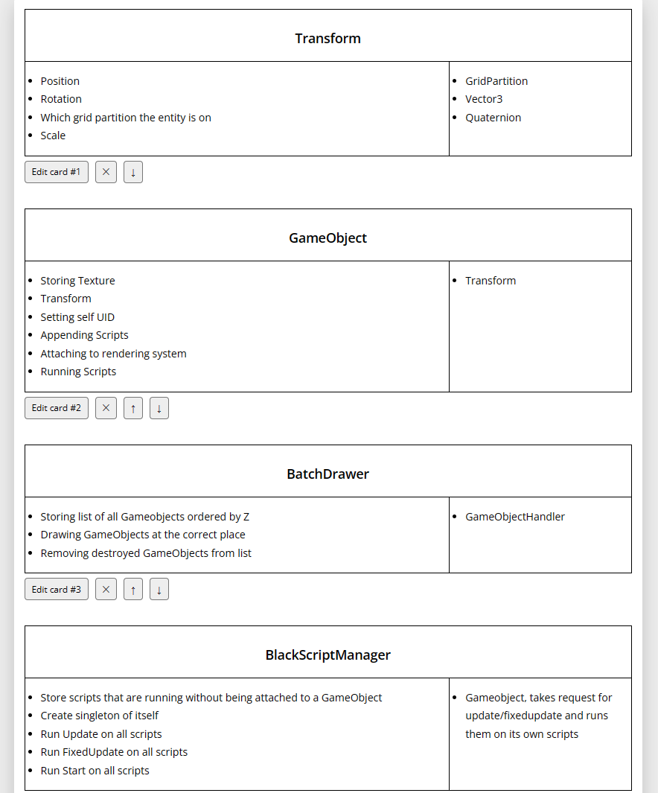
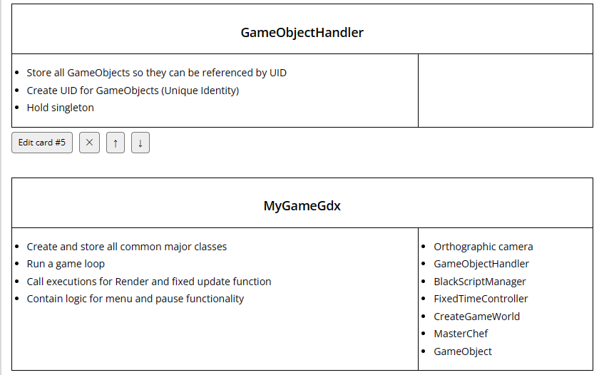
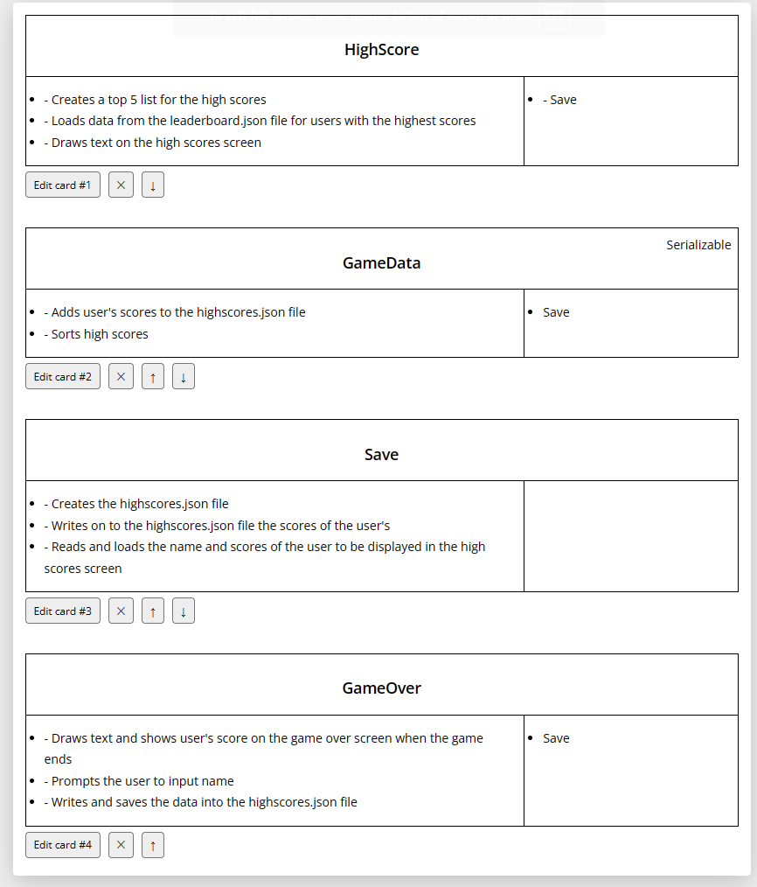
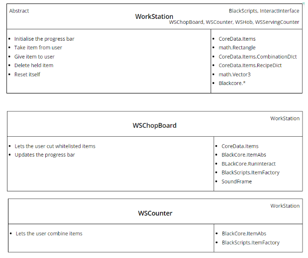
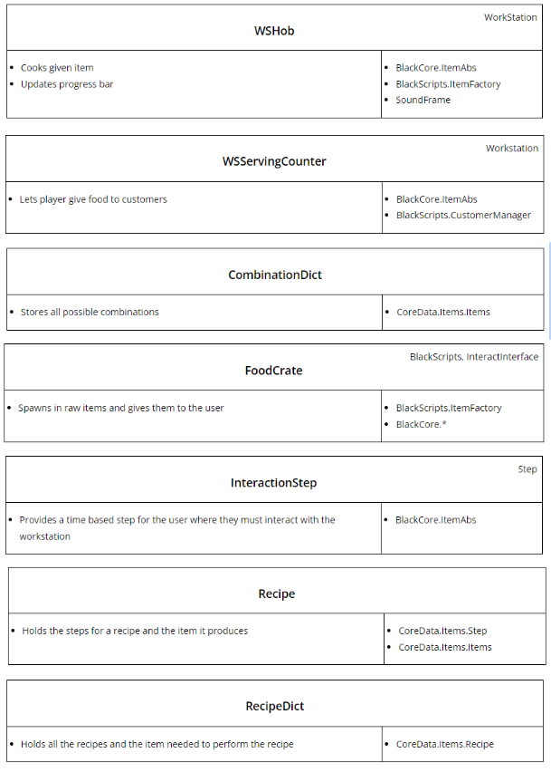
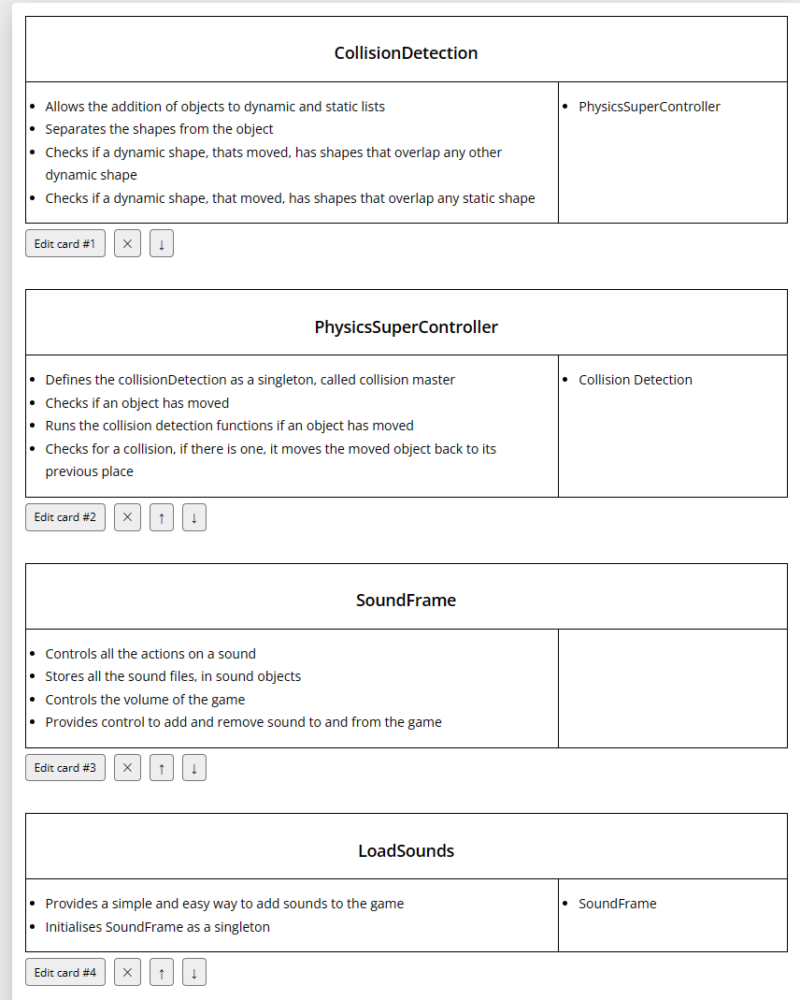

<h2>Architecture Diagrams</h2>
<figure markdown>
  
  <figurecaption>Sequence diagram for playing through the game (scenario mode)</figcaption>
 </figure>
 
<figure markdown>
  
  <figcaption>Total UML class diagram  </figcaption>
</figure>

<figure markdown>
  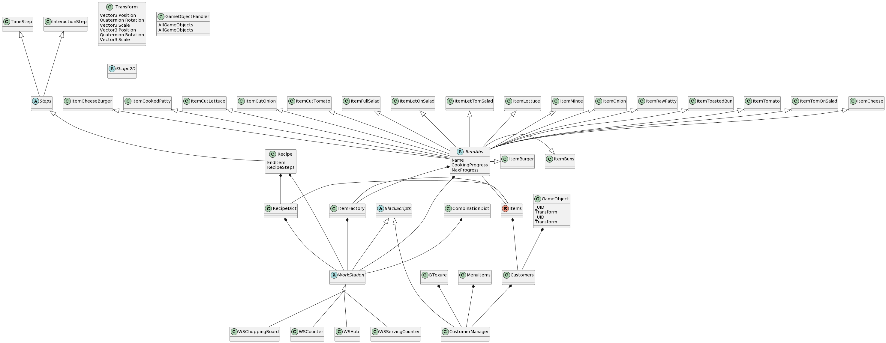
  <figcaption>Just Items and Workshops from previous diagram </figcaption>
</figure>

<figure markdown>
  
  <figcaption>Without every item being shown from previous diagram </figcaption>
</figure>

<figure markdown>
  
  <figcaption>UML class diagram of just the core engine </figcaption>
 </figure>
 
<figure markdown>
  
  <figcaption>Workstation class diagram version 1</figcaption>
</figure>

<figure markdown>
  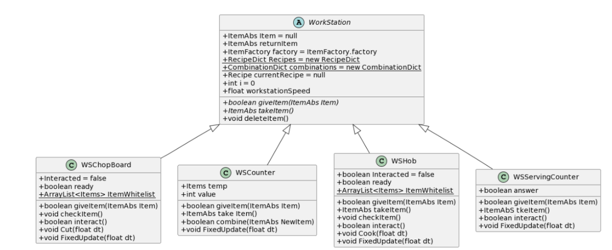
  <figcaption>Workstation class diagram version 2</figcaption>
</figure>

<figure markdown>
  
  <figcaption>Workstation class diagram version 3</figcaption>
</figure>
 
<figure markdown>
  
  <figcaption>GameObject BatchDrawer sequence diagram </figcaption>
</figure>

<figure markdown>
  
  <figcaption>MyGdxGame sequence diagram </figcaption>
</figure>

<figure markdown>
  
  <figcaption>Control chef sequence diagram </figcaption>
</figure>

<figure markdown>
  
  <figcaption>SoundFrame class diagram </figcaption>
</figure>

<figure markdown>
  
  <figcaption>Alternative representation of SoundFrame </figcaption>
</figure>

<figure markdown>
  
  <figcaption>CollisionDetection class diagram version 1</figcaption>
</figure>

<figure markdown>
  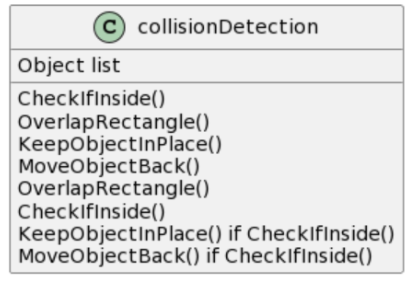
  <figcaption>Alternative representation of previous diagram </figcaption>
</figure>

<figure markdown>
  
  <figcaption>CollisionDetection class diagram version 2 </figcaption>
</figure>

<figure markdown>
  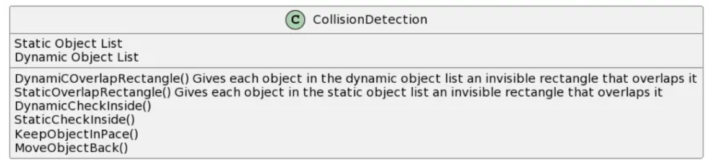
  <figcaption>Alternative representation of previous diagram </figcaption>
</figure>

<figure markdown>
  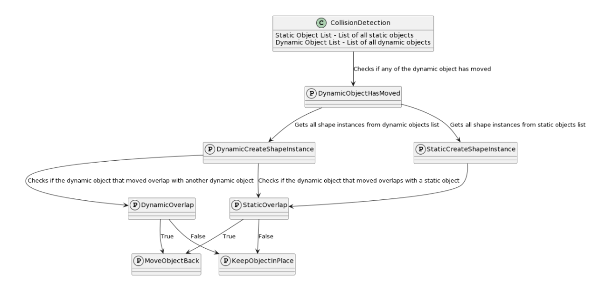
  <figcaption>CollisionDetection class diagram version 3 </figcaption>
</figure>

<figure markdown>
  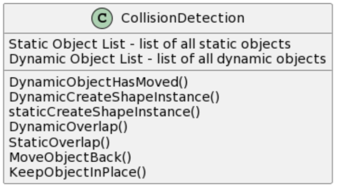
  <figcaption>Alternative representation of previous diagram </figcaption>
</figure>

<figure markdown>
  
  <figcaption>CollisionDetection sequence diagram </figcaption>
</figure>

<figure markdown>
  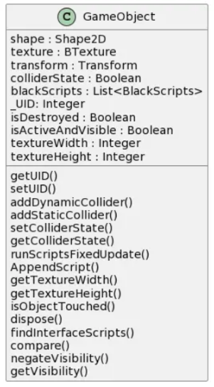
  <figcaption>GameObject class diagram </figcaption>
</figure>

<figure markdown>
  
  <figcaption>MyGdxGame class diagram </figcaption>
</figure>

<figure markdown>
  
  <figcaption>Pause state diagram </figcaption>
</figure>

<figure markdown>
  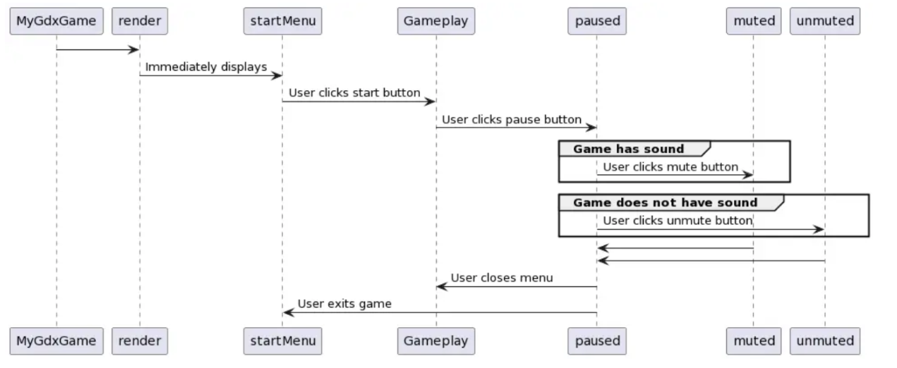
  <figcaption>Pause sequence diagram </figcaption>
</figure>

<figure markdown>
  
  <figcaption>Highscores sequence diagram </figcaption>
</figure>

<figure markdown>
  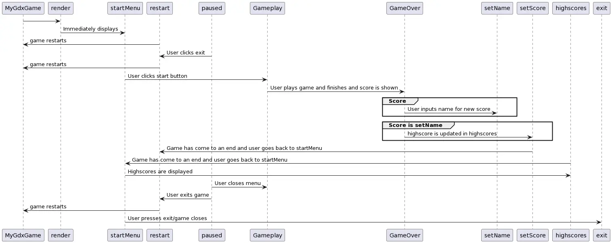
  <figcaption>Highscores sequence diagram version 2</figcaption>
</figure>

<figure markdown>
  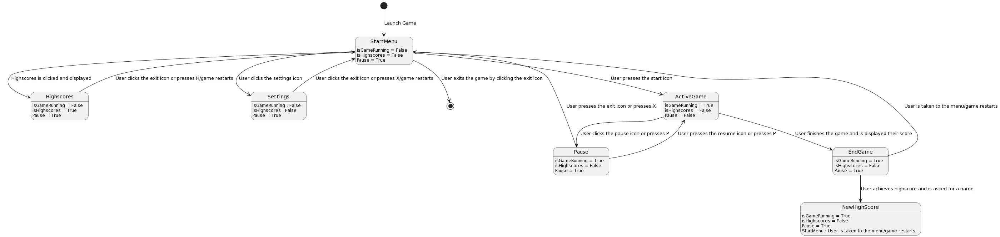
  <figcaption> Start menu state diagram</figcaption>
</figure>

<figure markdown>
  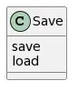
  <figcaption>Save class diagram</figcaption>
</figure>

<figure markdown>
  
  <figcaption>Save sequence class diagram </figcaption>
</figure>

<figure markdown>
  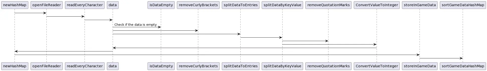
  <figcaption>Load sequence class diagram </figcaption>
</figure>

<figure markdown>
  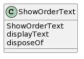
  <figcaption> ShowOrderText class diagram </figcaption>
</figure>

<figure markdown>
  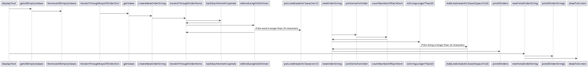
  <figcaption>Display text sequence diagram </figcaption>
</figure>

<figure markdown>
  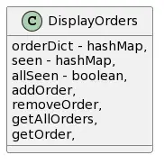
  <figcaption>DisplayOrders class diagram </figcaption>
</figure>

<figure markdown>
  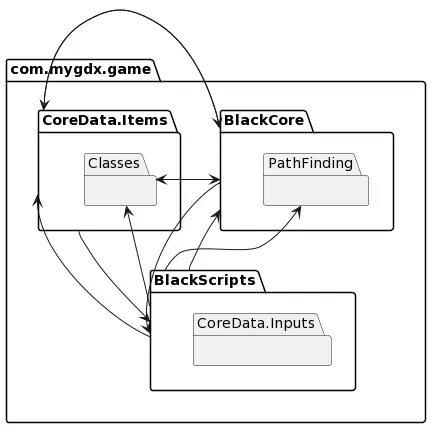
  <figcaption>com.mygdx.game package diagram </figcaption>
</figure>

<figure markdown>
  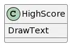
  <figcaption>HighScore class diagram </figcaption>
</figure>