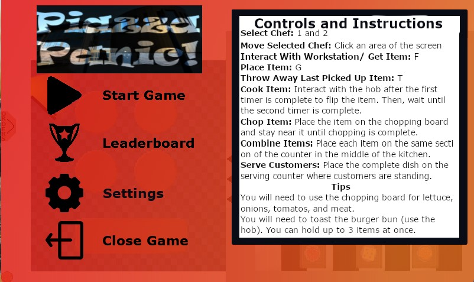
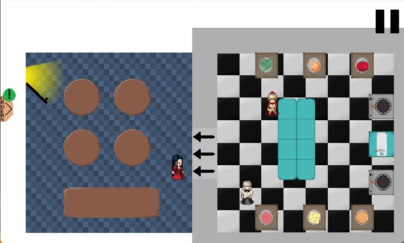
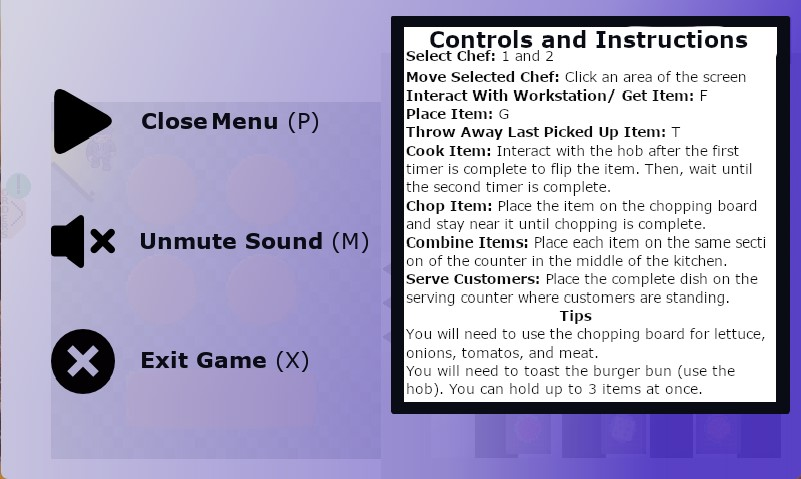
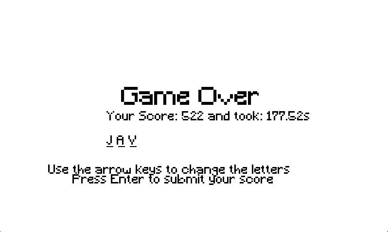
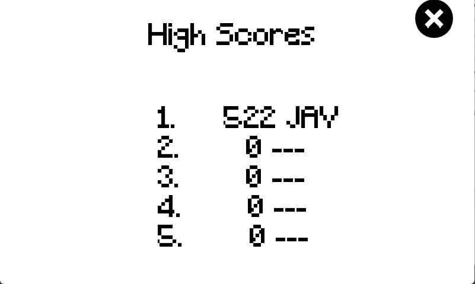

# Team BlackCatStudios Project 
{: style="height:150px;width:150px"}

See updates tab for weekly progress updates

<h1>Documents</h1>
- [Requirements](pdfs&txts/Req1.pdf)
- [Architecture](pdfs&txts/Arch1.pdf)
- [Method Selection & Planning](pdfs&txts/Plan1.pdf)
- [Risk Assessment and Mitigation](pdfs&txts/Risk1.pdf)
- [Implementation](pdfs&txts/Impl1.pdf)
- [Executable JAR](pdfs&txts/PiazzaPanicBCS.jar)
- [GitHub repository](https://github.com/Palindromae/BlackCatStudios)

<h1>Email addresses</h1>
- HS1944
- ES1917
- ATAB500
- SJRT501
- JV688
- JTH536

@york.ac.uk

<h1>Gameplay Video</h1>
[YouTube Link](https://www.youtube.com/watch?v=N0PkURKUNdA)

<h1>Presentation Slides</h1>
[Link](pdfs&txts/Demonstration 1.pptx)

<h1>Screenshots</h1>
<figure markdown>
  
  <figcaption>Game start screen</figcaption>
 </figure>
 
<figure markdown>
  
  <figcaption>Gameplay screen</figcaption>
</figure>

<figure markdown>
  
  <figcaption>Pause/ settings screen</figcaption>
</figure>

<figure markdown>
  
  <figcaption>Completion screen</figcaption>
</figure>

<figure markdown>
  
  <figcaption>Highscores screen</figcaption>
</figure>

