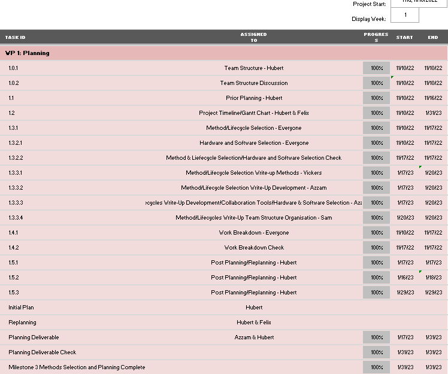

<h1>Weekly Gantt Chart Snapshots </h1>
**Note: Each section's images run continuously in the actual gantt chart but have been put on a new line to fit them on the page**
<h2>Final Snapshot Of The Gantt Chart</h2>
[Download link for final gantt chart](pdfs&txts/BlackCatStudiosGanttChartAssessment1.xlsx)
<h2>Autumn week 1 snapshot </h2>

<h2>Autumn week 2 snapshot</h2>

<h2>Autumn week 3 snapshot</h2>

<h2>Autumn week 4 snapshot</h2>

<h2>Spring week 1 snapshot</h2>
 
 
 
 
 
 

<h2>Spring week 2 snapshot</h2>
 
 
 
 
 
 
 
 

<h2>Spring week 2 snapshot</h2>
 
 
 
 
 
 

<h2>Spring week 4 snapshot</h2>
 
 
 
 
 
 
 